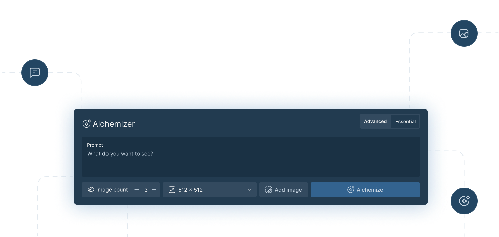

<div align="center">



# **📢 TensorAlchemy Moves to New GitHub Repository! 🚀** <!-- omit in toc -->
[](https://opensource.org/licenses/MIT)

</div>

## [New repository url](https://github.com/TensorAlchemy/TensorAlchemy)
https://github.com/TensorAlchemy/TensorAlchemy


We're thrilled to announce that we've migrated our codebase to the new TensorAlchemy repository on GitHub. The previous repository is now archived and read-only.

Let's continue building the future of TensorAlchemy together in our new GitHub home! 🌟

All miners and validators, please follow the guide below to stay up-to-date with the latest changes and contribute to the project:

## Migration Guide

1. **Open your terminal or command prompt and navigate to your local repository directory.**

2. **List your existing remotes to see the current configured remote repository.**

   ```
   git remote -v
   ```

   You should see the old remote repository URL listed, e.g.:

   ```
   origin  https://github.com/Supreme-Emperor-Wang/ImageAlchemy (fetch)
   origin  https://github.com/Supreme-Emperor-Wang/ImageAlchemy (push)
   ```

3. **Remove the old remote repository.**

   ```
   git remote remove origin
   ```

4. **Add the new remote repository.**

   ```
   git remote add origin https://github.com/TensorAlchemy/TensorAlchemy
   ```

   Or, if you prefer to use the SSH URL:

   ```
   git remote add origin git@github.com:TensorAlchemy/TensorAlchemy.git
   ```

5. **Verify that the new remote URL is set correctly.**

   ```
   git remote -v
   ```

   You should see the new repository URL listed, e.g.:

   ```
   origin  https://github.com/TensorAlchemy/TensorAlchemy (fetch)
   origin  https://github.com/TensorAlchemy/TensorAlchemy (push)
   ```

6. **Finally, fetch the latest changes from the new remote repository and merge them into your local branch.**

   ```
   git fetch origin
   git reset --hard origin/main
   ```

   Replace `main` with the name of the branch you want to reset to, if different.

After following these steps, your local repository should be updated to track the new `TensorAlchemy/TensorAlchemy` remote repository, and you should have the latest changes pulled from the new repository.

The TensorAlchemy Team
